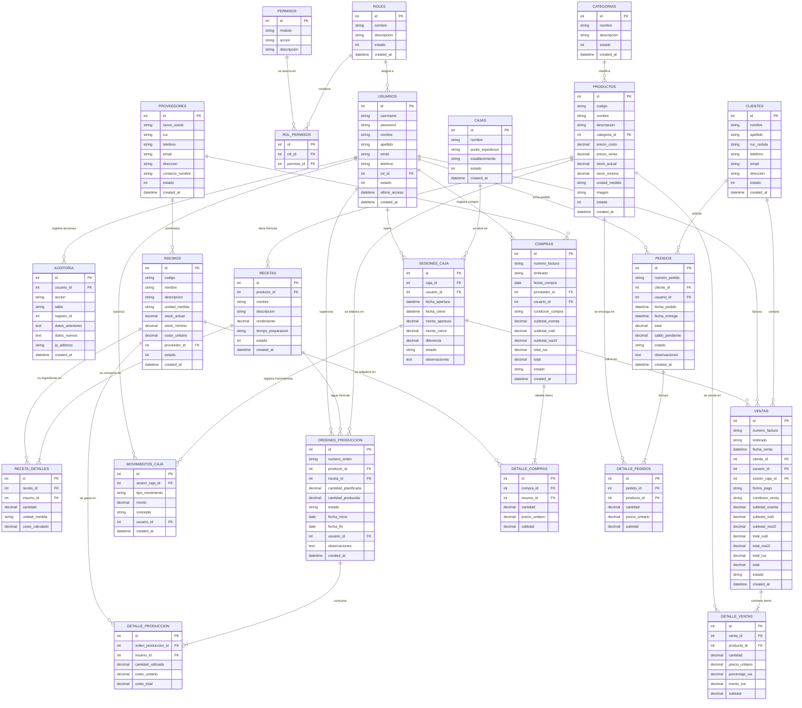

# Diagrama Entidad-Relación (DER)
## Sistema de Gestión para Panadería y Confitería
**Proyecto de Tesis - UNIGRAN**  
**Tesista:** Bruno Matías Báez Medina  
**Carrera:** Licenciatura en Análisis de Sistemas Informáticos  

---

## 1. Diagrama Entidad-Relación (Visual en Mermaid)

---

## 2. Diccionario de Entidades del Sistema

| Módulo | Entidad | Descripción |
| :--- | :--- | :--- |
| **Seguridad** | `ROLES` | Define los perfiles de usuario (Administrador, Panadero, Cajero, etc.). |
| **Seguridad** | `USUARIOS` | Operadores y personal con credenciales de acceso al software. |
| **Seguridad** | `PERMISOS` | Catálogo de privilegios granulares por módulo. |
| **Seguridad** | `ROL_PERMISOS` | Tabla asociativa de privilegios por cada rol. |
| **Seguridad** | `AUDITORIA` | Registro de trazabilidad y cambios de cada tabla. |
| **Inventario** | `CATEGORIAS` | Clasificación de productos terminados. |
| **Inventario** | `PROVEEDORES` | Personas físicas y jurídicas proveedoras de materia prima. |
| **Inventario** | `INSUMOS` | Materias primas pesables y contables (harina, levadura, etc.). |
| **Productos** | `PRODUCTOS` | Productos elaborados listos para mostrador o venta. |
| **Recetas** | `RECETAS` | Ficha técnica de formulación por producto. |
| **Recetas** | `RECETA_DETALLES`| Relación insumo-cantidad necesaria para la receta. |
| **Producción** | `ORDENES_PRODUCCION`| Planificación y lote de horneado/elaboración. |
| **Producción** | `DETALLE_PRODUCCION`| Insumos reales descontados de stock durante el lote. |
| **Caja** | `CAJAS` | Puntos físicos y timbrado de facturación. |
| **Caja** | `SESIONES_CAJA` | Control de turno, arqueo, saldo inicial y cierre. |
| **Caja** | `MOVIMIENTOS_CAJA` | Entradas/salidas extraordinarias de dinero. |
| **Ventas** | `VENTAS` | Cabecera del comprobante fiscal o ticket con IVA discriminado. |
| **Ventas** | `DETALLE_VENTAS` | Renglones de venta y cálculo por tasa impositiva (10%, 5%, Exenta). |
| **Compras** | `COMPRAS` | Cabecera de factura de compra recibida del proveedor. |
| **Compras** | `DETALLE_COMPRAS`| Renglones de insumos comprados con actualización de stock y costo. |
| **Pedidos** | `PEDIDOS` | Encargos anticipados con seña y fecha programada de entrega. |
| **Pedidos** | `DETALLE_PEDIDOS` | Productos solicitados en el encargo. |
| **Clientes** | `CLIENTES` | Clientes registrados con RUC o Cédula para facturación. |
