# Diagrama Entidad-Relación (DER)
## Sistema de Gestión de Inventario y Producción para Panadería y Confitería
**Proyecto Final de Grado (TFG) - UNIGRAN**  
**Tesista:** Bruno Matías Báez Medina  
**Tutora:** Dra. Francisca Castillo  
**Carrera:** Licenciatura en Análisis de Sistemas Informáticos  
**Total de Entidades Implementadas:** 38 tablas  
**Última Actualización:** Octubre 2026 (RBAC, Facturación Legal y Sesiones de Caja)  

---

## 1. Diagrama Entidad-Relación Completo (Mermaid)

```mermaid
erDiagram

    %% ==========================================
    %% MÓDULO 1: SEGURIDAD Y CONTROL DE ACCESO (RBAC)
    %% ==========================================
    USUARIOS {
        int id PK
        string nombre
        string email
        string password
        string rol "admin | deposito | vendedor | produccion"
        string telefono
        int estado
        datetime created_at
    }

    AUDITORIA_LOGS {
        int id PK
        int usuario_id FK
        string accion
        string tabla_afectada
        int registro_id
        text detalles
        string ip
        datetime fecha
    }

    %% ==========================================
    %% MÓDULO 2: CATÁLOGOS BASE E INVENTARIO
    %% ==========================================
    CATEGORIAS {
        int id PK
        string nombre
        string descripcion
        string tipo "materia_prima | producto_terminado"
    }

    UNIDADES_MEDIDA {
        int id PK
        string nombre
        string simbolo
    }

    DEPOSITOS {
        int id PK
        string nombre
        string ubicacion
        string descripcion
        int es_principal
        datetime created_at
    }

    PROVEEDORES {
        int id PK
        string ruc
        string razon_social
        string contacto_nombre
        string telefono
        string email
        string direccion
        string ciudad
        int estado
        datetime created_at
    }

    PRODUCTOS {
        int id PK
        string codigo
        string codigo_barra
        string nombre
        string descripcion
        string tipo "materia_prima | producto_terminado"
        int categoria_id FK
        int unidad_id FK
        decimal stock_minimo
        decimal stock_maximo
        decimal precio_costo
        decimal precio_venta
        decimal iva "0 | 5 | 10"
        int estado
        datetime created_at
    }

    STOCK_DEPOSITO {
        int id PK
        int producto_id FK
        int deposito_id FK
        decimal cantidad
    }

    LOTES {
        int id PK
        int producto_id FK
        int deposito_id FK
        string codigo_lote
        decimal cantidad_inicial
        decimal cantidad_actual
        date fecha_elaboracion
        date fecha_vencimiento
        decimal precio_compra
        string estado "activo | vencido | agotado"
        datetime created_at
    }

    %% ==========================================
    %% MÓDULO 3: FÓRMULAS Y PRODUCCIÓN (CUADRA)
    %% ==========================================
    RECETAS {
        int id PK
        string codigo
        string nombre
        string descripcion
        int producto_terminado_id FK
        decimal rendimiento_unidades
        int tiempo_estimado_min
        decimal costo_estimado
        int estado
        datetime created_at
    }

    RECETAS_DETALLES {
        int id PK
        int receta_id FK
        int insumo_id FK
        decimal cantidad_requerida
    }

    PRODUCCIONES {
        int id PK
        string codigo
        int receta_id FK
        int producto_terminado_id FK
        int deposito_origen_id FK
        int deposito_destino_id FK
        decimal cantidad_planificada
        decimal cantidad_obtenida
        decimal merma_estimada
        decimal costo_total
        string estado "planificada | en_proceso | finalizada | cancelada"
        int usuario_id FK
        date fecha_produccion
        text observaciones
        datetime created_at
    }

    %% ==========================================
    %% MÓDULO 4: LOGÍSTICA, MERMAS Y KARDEX
    %% ==========================================
    TRANSFERENCIAS {
        int id PK
        string codigo
        int deposito_origen_id FK
        int deposito_destino_id FK
        int usuario_id FK
        date fecha
        string motivo
        string estado "pendiente | completada | cancelada"
        datetime created_at
    }

    TRANSFERENCIAS_DETALLES {
        int id PK
        int transferencia_id FK
        int producto_id FK
        int lote_id
        decimal cantidad
    }

    AJUSTES_STOCK {
        int id PK
        string codigo
        int deposito_id FK
        int usuario_id FK
        date fecha
        string tipo_ajuste "ingreso | egreso | inventario_fisico"
        string motivo "merma | vencimiento | rotura | recuento_fisico | otro"
        text observaciones
        datetime created_at
    }

    AJUSTES_DETALLES {
        int id PK
        int ajuste_id FK
        int producto_id FK
        decimal cantidad_anterior
        decimal cantidad_ajustada
        decimal diferencia
    }

    KARDEX {
        int id PK
        datetime fecha
        int producto_id FK
        int deposito_id FK
        string tipo_movimiento "COMPRA | VENTA | PRODUCCION_ENTRADA | CONSUMO_INSUMOS | TRANSFERENCIA_ENTRADA | TRANSFERENCIA_SALIDA | AJUSTE_POSITIVO | AJUSTE_NEGATIVO"
        int referencia_id
        string referencia_documento
        decimal cantidad_entrada
        decimal cantidad_salida
        decimal saldo_resultante
        decimal costo_unitario
        decimal costo_total
        int usuario_id FK
        text observaciones
    }

    %% ==========================================
    %% MÓDULO 5: CAJA, ARQUEO Y COBRANZAS
    %% ==========================================
    CAJAS {
        int id PK
        string nombre
        string punto_expedicion "001"
        string establecimiento "001"
        int estado
        datetime created_at
    }

    SESIONES_CAJA {
        int id PK
        int caja_id FK
        int usuario_id FK
        datetime fecha_apertura
        datetime fecha_cierre
        decimal monto_apertura
        decimal monto_sistema
        decimal monto_cierre_efectivo
        decimal diferencia
        decimal recaudacion_depositar
        string estado "abierta | cerrada"
        text observaciones
    }

    MOVIMIENTOS_CAJA {
        int id PK
        int sesion_caja_id FK
        string tipo_movimiento "ingreso | egreso"
        string concepto
        decimal monto
        int usuario_id FK
        datetime created_at
    }

    CUENTAS_COBRAR {
        int id PK
        int venta_id FK
        int cliente_id FK
        int numero_cuota
        int total_cuotas
        decimal monto_cuota
        decimal saldo_pendiente
        date fecha_vencimiento
        string estado "pendiente | parcial | pagada | vencida"
        datetime created_at
    }

    COBROS {
        int id PK
        string numero_recibo
        int cliente_id FK
        int sesion_caja_id FK
        int usuario_id FK
        datetime fecha_cobro
        decimal monto_total
        string forma_cobro "efectivo | tarjeta | transferencia_qr | cheque"
        text observaciones
        datetime created_at
    }

    COBROS_DETALLES {
        int id PK
        int cobro_id FK
        int cuenta_cobrar_id FK
        decimal monto_aplicado
    }

    %% ==========================================
    %% MÓDULO 6: VENTAS Y FACTURACIÓN LEGAL
    %% ==========================================
    CLIENTES {
        int id PK
        string ruc_ci
        string nombre_razon
        string telefono
        string email
        string direccion
        datetime created_at
    }

    VENTAS {
        int id PK
        string numero_comprobante
        string tipo_comprobante "ticket | factura"
        string timbrado "18278546"
        int cliente_id FK
        int usuario_id FK
        int deposito_id FK
        int sesion_caja_id FK
        string condicion_venta "contado | credito"
        datetime fecha_venta
        decimal subtotal
        decimal iva_5
        decimal iva_10
        decimal total
        string metodo_pago "efectivo | tarjeta | transferencia_qr | mixto"
        decimal monto_recibido
        decimal vuelto
        string estado "completada | anulada"
        datetime created_at
    }

    VENTAS_DETALLES {
        int id PK
        int venta_id FK
        int producto_id FK
        decimal cantidad
        decimal precio_unitario
        decimal iva_tipo "0 | 5 | 10"
        decimal subtotal
    }

    %% ==========================================
    %% MÓDULO 7: CICLO COMPLETO DE COMPRAS
    %% ==========================================
    PEDIDOS_COMPRAS {
        int id PK
        string numero_pedido
        int usuario_id FK
        date fecha_pedido
        date fecha_requerida
        string prioridad "baja | media | alta | urgente"
        string estado "pendiente | aprobado | rechazado | ordenado"
        text observaciones
        datetime created_at
    }

    PEDIDOS_COMPRAS_DETALLES {
        int id PK
        int pedido_compra_id FK
        int producto_id FK
        decimal cantidad_solicitada
        text observaciones
    }

    ORDENES_COMPRAS {
        int id PK
        string numero_orden
        int pedido_compra_id FK
        int proveedor_id FK
        int usuario_id FK
        date fecha_orden
        date fecha_entrega_esperada
        string condicion_pago "contado | credito_15 | credito_30 | credito_60"
        decimal subtotal
        decimal total
        string estado "emitida | recibida | cancelada"
        text observaciones
        datetime created_at
    }

    ORDENES_COMPRAS_DETALLES {
        int id PK
        int orden_compra_id FK
        int producto_id FK
        decimal cantidad
        decimal precio_unitario
        decimal subtotal
    }

    COMPRAS {
        int id PK
        int proveedor_id FK
        int deposito_id FK
        int orden_compra_id FK
        int usuario_id FK
        string numero_factura
        string timbrado "12345678"
        date fecha_compra
        decimal total
        string condicion "contado | credito"
        text observaciones
        datetime created_at
    }

    COMPRAS_DETALLES {
        int id PK
        int compra_id FK
        int producto_id FK
        string codigo_lote
        date fecha_vencimiento
        decimal cantidad
        decimal precio_unitario
        decimal subtotal
    }

    NOTAS_CREDITO_COMPRAS {
        int id PK
        string numero_nota
        string timbrado
        int compra_id FK
        int proveedor_id FK
        int usuario_id FK
        date fecha_emision
        string motivo "devolucion_mercaderia | descuento_comercial | error_facturacion | otro"
        decimal total
        text observaciones
        datetime created_at
    }

    NOTAS_CREDITO_COMPRAS_DETALLES {
        int id PK
        int nota_credito_id FK
        int producto_id FK
        decimal cantidad
        decimal precio_unitario
        decimal subtotal
    }

    %% ==========================================
    %% MÓDULO 8: SERVICIOS Y PRESUPUESTOS DE EVENTOS
    %% ==========================================
    SERVICIOS {
        int id PK
        string codigo
        string nombre
        text descripcion
        decimal precio_sugerido
        string unidad_servicio
        int estado
        datetime created_at
    }

    PRESUPUESTOS {
        int id PK
        string numero_presupuesto
        int cliente_id FK
        int usuario_id FK
        date fecha_emision
        date fecha_vencimiento
        decimal subtotal
        decimal descuento
        decimal total
        string estado "pendiente | aprobado | rechazado | vencido | facturado"
        text observaciones
        datetime created_at
    }

    PRESUPUESTOS_DETALLES {
        int id PK
        int presupuesto_id FK
        string tipo_item "producto | servicio"
        int producto_id FK
        int servicio_id FK
        string descripcion
        decimal cantidad
        decimal precio_unitario
        decimal subtotal
    }

    PEDIDOS_SERVICIOS {
        int id PK
        string numero_servicio
        int presupuesto_id FK
        int cliente_id FK
        int usuario_id FK
        date fecha_evento
        string hora_evento
        string lugar_evento
        decimal total
        decimal senia_pagada
        decimal saldo_pendiente
        string estado "programado | en_preparacion | entregado | finalizado | cancelado"
        text observaciones
        datetime created_at
    }

    %% ==========================================
    %% RELACIONES ENTRE ENTIDADES (CARDINALIDAD)
    %% ==========================================
    USUARIOS ||--o{ AUDITORIA_LOGS : "genera traza"
    CATEGORIAS ||--o{ PRODUCTOS : "clasifica"
    UNIDADES_MEDIDA ||--o{ PRODUCTOS : "mide"
    DEPOSITOS ||--o{ STOCK_DEPOSITO : "almacena"
    PRODUCTOS ||--o{ STOCK_DEPOSITO : "tiene existencia"
    PRODUCTOS ||--o{ LOTES : "controla partida"
    DEPOSITOS ||--o{ LOTES : "ubica partida"

    PRODUCTOS ||--o{ RECETAS : "elabora producto"
    RECETAS ||--|{ RECETAS_DETALLES : "requiere insumos"
    PRODUCTOS ||--o{ RECETAS_DETALLES : "utilizado como insumo"
    RECETAS ||--o{ PRODUCCIONES : "guia elaboracion"
    USUARIOS ||--o{ PRODUCCIONES : "supervisa panadero"
    DEPOSITOS ||--o{ PRODUCCIONES : "origen materia prima"
    DEPOSITOS ||--o{ PRODUCCIONES : "destino panificado"

    DEPOSITOS ||--o{ TRANSFERENCIAS : "origen / destino"
    USUARIOS ||--o{ TRANSFERENCIAS : "autoriza traslado"
    TRANSFERENCIAS ||--|{ TRANSFERENCIAS_DETALLES : "detalla items"
    AJUSTES_STOCK ||--|{ AJUSTES_DETALLES : "detalla diferencias"
    USUARIOS ||--o{ AJUSTES_STOCK : "responsable recuento"
    DEPOSITOS ||--o{ AJUSTES_STOCK : "aplica en"
    PRODUCTOS ||--o{ KARDEX : "movimiento fisico"
    DEPOSITOS ||--o{ KARDEX : "saldo en almacen"
    USUARIOS ||--o{ KARDEX : "operador movimiento"

    CAJAS ||--o{ SESIONES_CAJA : "terminal de operacion"
    USUARIOS ||--o{ SESIONES_CAJA : "cajero responsable"
    SESIONES_CAJA ||--o{ MOVIMIENTOS_CAJA : "arquea gastos/ingresos"
    USUARIOS ||--o{ MOVIMIENTOS_CAJA : "registra movimiento"
    SESIONES_CAJA ||--o{ VENTAS : "recauda ingresos POS"
    SESIONES_CAJA ||--o{ COBROS : "ingresa efectivo cobranza"

    CLIENTES ||--o{ VENTAS : "adquiere comprobante"
    USUARIOS ||--o{ VENTAS : "vendedor / cajero emite"
    DEPOSITOS ||--o{ VENTAS : "despacha stock"
    VENTAS ||--|{ VENTAS_DETALLES : "contiene items"
    PRODUCTOS ||--o{ VENTAS_DETALLES : "vendido en linea"
    VENTAS ||--o{ CUENTAS_COBRAR : "origina saldo a credito"
    CLIENTES ||--o{ CUENTAS_COBRAR : "mantiene deuda"
    CUENTAS_COBRAR ||--o{ COBROS_DETALLES : "amortiza cuota"
    COBROS ||--|{ COBROS_DETALLES : "discrimina pagos"
    CLIENTES ||--o{ COBROS : "abona recibo oficial"
    USUARIOS ||--o{ COBROS : "cobrador emite recibo"

    USUARIOS ||--o{ PEDIDOS_COMPRAS : "panadero solicita insumos"
    PEDIDOS_COMPRAS ||--|{ PEDIDOS_COMPRAS_DETALLES : "especifica materias primas"
    PEDIDOS_COMPRAS ||--o{ ORDENES_COMPRAS : "consolida en orden"
    PROVEEDORES ||--o{ ORDENES_COMPRAS : "recibe orden"
    USUARIOS ||--o{ ORDENES_COMPRAS : "comprador autoriza"
    ORDENES_COMPRAS ||--|{ ORDENES_COMPRAS_DETALLES : "lineas autorizadas"
    ORDENES_COMPRAS ||--o{ COMPRAS : "recibe factura"
    PROVEEDORES ||--o{ COMPRAS : "factura mercaderia"
    DEPOSITOS ||--o{ COMPRAS : "ingresa a deposito"
    USUARIOS ||--o{ COMPRAS : "almacenero recepciona"
    COMPRAS ||--|{ COMPRAS_DETALLES : "renglones con lote/vencimiento"
    PRODUCTOS ||--o{ COMPRAS_DETALLES : "materia prima ingresada"
    COMPRAS ||--o{ NOTAS_CREDITO_COMPRAS : "devolucion de compra"
    PROVEEDORES ||--o{ NOTAS_CREDITO_COMPRAS : "emite nota credito"
    USUARIOS ||--o{ NOTAS_CREDITO_COMPRAS : "administra reclamo"
    NOTAS_CREDITO_COMPRAS ||--|{ NOTAS_CREDITO_COMPRAS_DETALLES : "items devueltos"

    CLIENTES ||--o{ PRESUPUESTOS : "solicita cotizacion"
    USUARIOS ||--o{ PRESUPUESTOS : "vendedor asesora"
    PRESUPUESTOS ||--|{ PRESUPUESTOS_DETALLES : "renglones presupuestados"
    SERVICIOS ||--o{ PRESUPUESTOS_DETALLES : "servicio de catering"
    PRODUCTOS ||--o{ PRESUPUESTOS_DETALLES : "panificados para evento"
    PRESUPUESTOS ||--o{ PEDIDOS_SERVICIOS : "convierte a orden"
    CLIENTES ||--o{ PEDIDOS_SERVICIOS : "contrata evento"
    USUARIOS ||--o{ PEDIDOS_SERVICIOS : "coordina entrega"
```

---

## 2. Matriz de Control de Acceso (RBAC) y Seguridad

La entidad `usuarios` implementa la columna `rol` con cuatro perfiles rigurosamente diferenciados y protegidos mediante `checkRole` en la API REST y control dinámico en la SPA:

| Rol del Sistema | Entidades con Permiso de Escritura / Operación | Entidades en Solo Lectura | Entidades Restringidas |
| :--- | :--- | :--- | :--- |
| **`admin`** (Administrador) | Acceso total a las 38 entidades del sistema | Ninguna | Ninguna |
| **`deposito`** (Depósito / Inventario) | `stock_deposito`, `lotes`, `transferencias`, `transferencias_detalles`, `ajustes_stock`, `ajustes_detalles`, `compras`, `compras_detalles`, `pedidos_compras`, `ordenes_compras`, `productos` | `recetas`, `kardex`, `proveedores` | `cajas`, `sesiones_caja`, `movimientos_caja`, `ventas`, `ventas_detalles`, `cuentas_cobrar`, `cobros`, `usuarios` |
| **`vendedor`** (Ventas / Cajero) | `sesiones_caja`, `movimientos_caja`, `ventas`, `ventas_detalles`, `clientes`, `cuentas_cobrar`, `cobros`, `cobros_detalles`, `presupuestos`, `pedidos_servicios` | `productos`, `cajas`, `servicios` | `recetas`, `recetas_detalles`, `producciones`, `compras`, `ordenes_compras`, `depositos`, `ajustes_stock`, `usuarios` |
| **`produccion`** (Producción / Panadero) | `recetas`, `recetas_detalles`, `producciones`, `pedidos_compras`, `pedidos_compras_detalles` | `productos`, `categorias`, `unidades_medida`, `depositos`, `compras` | `cajas`, `sesiones_caja`, `ventas`, `clientes`, `cuentas_cobrar`, `cobros`, `transferencias`, `ajustes_stock`, `usuarios` |

---

## 3. Diccionario de Datos por Módulos (38 Tablas)

### Módulo 1: Seguridad y Auditoría
1. **`usuarios`**: Almacena las credenciales con hash Bcrypt, roles (`admin`, `deposito`, `vendedor`, `produccion`), estado y datos de contacto.
2. **`auditoria_logs`**: Trazabilidad completa con IP, acción efectuada, tabla afectada y registro alterado para auditoría forense.

### Módulo 2: Catálogos Base e Inventario Físico
3. **`categorias`**: Clasificación jerárquica de materias primas y productos terminados.
4. **`unidades_medida`**: Unidades estándar de panadería (Kg, Gr, Litros, Bolsas, Docenas, Unidades).
5. **`depositos`**: Almacenes físicos de la panadería (Depósito Central, Cuadra de Producción, Salón Mostrador).
6. **`proveedores`**: Datos legales de molinos, distribuidores de grasas y lácteos (RUC, Razón Social, Teléfono).
7. **`productos`**: Ficha maestra de insumos y panificados elaborados (stocks de seguridad, precios, IVA 5%/10%).
8. **`stock_deposito`**: Existencia consolidada por artículo en cada ubicación física.
9. **`lotes`**: Control de trazabilidad FEFO (*First Expired, First Out*) con fechas de elaboración y vencimiento.

### Módulo 3: Fórmulas y Producción (Cuadra)
10. **`recetas`**: Ficha técnica estándar de panadería (rendimiento en unidades, costo unitario teórico, tiempo de leudado/horno).
11. **`recetas_detalles`**: Proporciones de materias primas por masa base o pastón.
12. **`producciones`**: Órdenes de horneada ejecutadas, consumo automático de insumos, producto obtenido, merma y costo real.

### Módulo 4: Logística, Ajustes y Libro Kardex
13. **`transferencias`**: Movimiento formal entre depósitos (ej. del Depósito Central a Mostrador).
14. **`transferencias_detalles`**: Renglones e insumos transferidos con identificación de lote.
15. **`ajustes_stock`**: Regularización de existencias por roturas, mermas de masa o recuentos físicos.
16. **`ajustes_detalles`**: Registro de diferencia positiva o negativa por artículo.
17. **`kardex`**: Libro formal contable de movimientos con valorización, saldo acumulado y documento origen.

### Módulo 5: Gestión de Caja y Cobranzas
18. **`cajas`**: Terminales físicas de expedición con asignación de establecimiento (`001`) y punto de emisión (`001`).
19. **`sesiones_caja`**: Turnos de caja con fondo de apertura, recaudación del sistema, efectivo contado, diferencia y recaudación a depositar.
20. **`movimientos_caja`**: Entradas y salidas operativas menores (pagos de flete, compras de hielo, adelantos).
21. **`cuentas_cobrar`**: Cartera de créditos otorgados a clientes habituales o comercios revendedores.
22. **`cobros`**: Recibos oficiales de cobranza (`REC-XXXXXXX`) con discriminación de medio de pago.
23. **`cobros_detalles`**: Imputación de pagos a una o varias cuotas pendientes.

### Módulo 6: Ventas y Facturación Legal
24. **`clientes`**: Padrón de clientes particulares y comerciales con Cédula o RUC y Razón Social.
25. **`ventas`**: Comprobantes fiscales emitidos con **Timbrado N° 18278546**, condición (Contado/Crédito), vinculación obligatoria a la sesión de caja abierta (`sesion_caja_id`) y discriminación del IVA.
26. **`ventas_detalles`**: Renglones facturados con cantidad, precio pactado y tasa del IVA (10% o 5%).

### Módulo 7: Ciclo Integral de Compras a Proveedores
27. **`pedidos_compras`**: Requerimientos internos de insumos solicitados desde la cuadra de panadería.
28. **`pedidos_compras_detalles`**: Renglones de insumos solicitados con cantidad requerida.
29. **`ordenes_compras`**: Órdenes formales emitidas a los proveedores con condiciones comerciales y precios pactados.
30. **`ordenes_compras_detalles`**: Detalle valorizado de la orden de compra.
31. **`compras`**: Facturas de compra registradas con Timbrado del proveedor e ingreso automático de stock al depósito.
32. **`compras_detalles`**: Registro de insumos comprados con generación inmediata del lote y fecha de vencimiento.
33. **`notas_credito_compras`**: Notas de crédito recibidas de proveedores por devoluciones de mercadería dañada o descuentos.
34. **`notas_credito_compras_detalles`**: Renglones devueltos que generan salida de inventario y ajuste en Kardex.

### Módulo 8: Servicios Especiales y Presupuestos
35. **`servicios`**: Catálogo de servicios para eventos (Coffee Break empresarial, mesas de dulces, mozos, alquiler de vajilla).
36. **`presupuestos`**: Cotizaciones formales emitidas a clientes con fecha de validez y descuento aplicado.
37. **`presupuestos_detalles`**: Renglones combinados que integran tanto productos de panadería como servicios tercerizados.
38. **`pedidos_servicios`**: Contratos de prestación de eventos confirmados con seña pagada, saldo pendiente, lugar y horario de entrega.

---

## 4. Reglas de Integridad y Trazabilidad

1. **Ventas y Recaudación de Caja:**  
   Toda venta generada en el Punto de Venta (POS) hereda obligatoriamente el `sesion_caja_id` del turno activo, garantizando que el arqueo de caja refleje en tiempo real la recaudación exacta por método de pago.
2. **Facturación Fiscal Impositiva:**  
   La entidad `ventas` incluye el campo fiscal obligatorio `timbrado` (Valor por defecto: `18278546`), emitiendo comprobantes válidos según los lineamientos tributarios de la Dirección Nacional de Ingresos Tributarios (DNIT).
3. **Consumo y Transformación de Inventario:**  
   Al procesar una orden en `producciones`, el sistema descuenta automáticamente las materias primas del depósito de origen y da de alta el lote del panificado terminado en el depósito de destino, generando los asientos en `kardex`.
4. **Trazabilidad FEFO de Insumos:**  
   Cada ingreso registrado en `compras_detalles` genera un registro en `lotes`, asegurando que las órdenes de horneada consuman siempre los insumos con vencimiento más próximo.
