# Diagrama Entidad-Relación (DER)
## Sistema de Gestión para Panadería y Confitería
**Proyecto de Tesis - UNIGRAN**  
**Tesista:** Bruno Matías Báez Medina  
**Carrera:** Licenciatura en Análisis de Sistemas Informáticos  
**Total de Tablas Implementadas:** 34 tablas  

---

## 1. Diagrama Entidad-Relación (Mermaid)

```mermaid
erDiagram

    %% ==========================================
    %% MÓDULO: SEGURIDAD Y ACCESOS
    %% ==========================================
    USUARIOS {
        int id PK
        string nombre
        string email
        string password
        string rol
        string telefono
        int estado
        datetime created_at
    }

    AUDITORIA_LOGS {
        int id PK
        int usuario_id FK
        string accion
        string tabla_afectada
        int registro_id
        text detalles
        string ip
        datetime fecha
    }

    %% ==========================================
    %% MÓDULO: CATÁLOGOS BASE E INVENTARIO
    %% ==========================================
    CATEGORIAS {
        int id PK
        string nombre
        string descripcion
        string tipo
    }

    UNIDADES_MEDIDA {
        int id PK
        string nombre
        string simbolo
    }

    DEPOSITOS {
        int id PK
        string nombre
        string ubicacion
        string descripcion
        int es_principal
        datetime created_at
    }

    PROVEEDORES {
        int id PK
        string ruc
        string razon_social
        string contacto_nombre
        string telefono
        string email
        string direccion
        string ciudad
        int estado
        datetime created_at
    }

    PRODUCTOS {
        int id PK
        string codigo
        string codigo_barra
        string nombre
        string descripcion
        string tipo
        int categoria_id FK
        int unidad_id FK
        decimal stock_minimo
        decimal stock_maximo
        decimal precio_costo
        decimal precio_venta
        decimal iva
        int estado
        datetime created_at
    }

    STOCK_DEPOSITO {
        int id PK
        int producto_id FK
        int deposito_id FK
        decimal cantidad
    }

    LOTES {
        int id PK
        int producto_id FK
        int deposito_id FK
        string codigo_lote
        decimal cantidad_inicial
        decimal cantidad_actual
        date fecha_elaboracion
        date fecha_vencimiento
        decimal precio_compra
        string estado
        datetime created_at
    }

    %% ==========================================
    %% MÓDULO: FÓRMULAS Y PRODUCCIÓN
    %% ==========================================
    RECETAS {
        int id PK
        string codigo
        string nombre
        string descripcion
        int producto_terminado_id FK
        decimal rendimiento_unidades
        int tiempo_estimado_min
        decimal costo_estimado
        int estado
        datetime created_at
    }

    RECETAS_DETALLES {
        int id PK
        int receta_id FK
        int insumo_id FK
        decimal cantidad_requerida
    }

    PRODUCCIONES {
        int id PK
        string codigo
        int receta_id FK
        int producto_terminado_id FK
        int deposito_origen_id FK
        int deposito_destino_id FK
        decimal cantidad_planificada
        decimal cantidad_obtenida
        decimal merma_estimada
        decimal costo_total
        string estado
        int usuario_id FK
        date fecha_produccion
        text observaciones
        datetime created_at
    }

    %% ==========================================
    %% MÓDULO: LOGÍSTICA, MERMAS Y KARDEX
    %% ==========================================
    TRANSFERENCIAS {
        int id PK
        string codigo
        int deposito_origen_id FK
        int deposito_destino_id FK
        int usuario_id FK
        date fecha
        string motivo
        string estado
        datetime created_at
    }

    TRANSFERENCIAS_DETALLES {
        int id PK
        int transferencia_id FK
        int producto_id FK
        int lote_id
        decimal cantidad
    }

    AJUSTES_STOCK {
        int id PK
        string codigo
        int deposito_id FK
        int usuario_id FK
        date fecha
        string tipo_ajuste
        string motivo
        text observaciones
        datetime created_at
    }

    AJUSTES_DETALLES {
        int id PK
        int ajuste_id FK
        int producto_id FK
        decimal cantidad_anterior
        decimal cantidad_ajustada
        decimal diferencia
    }

    KARDEX {
        int id PK
        datetime fecha
        int producto_id FK
        int deposito_id FK
        string tipo_movimiento
        int referencia_id
        string referencia_documento
        decimal cantidad_entrada
        decimal cantidad_salida
        decimal saldo_resultante
        decimal costo_unitario
        decimal costo_total
        int usuario_id FK
        text observaciones
    }

    %% ==========================================
    %% MÓDULO: CAJA, ARQUEO Y COBRANZAS
    %% ==========================================
    CAJAS {
        int id PK
        string nombre
        string punto_expedicion
        string establecimiento
        int estado
        datetime created_at
    }

    SESIONES_CAJA {
        int id PK
        int caja_id FK
        int usuario_id FK
        datetime fecha_apertura
        datetime fecha_cierre
        decimal monto_apertura
        decimal monto_sistema
        decimal monto_cierre_efectivo
        decimal diferencia
        decimal recaudacion_depositar
        string estado
        text observaciones
    }

    MOVIMIENTOS_CAJA {
        int id PK
        int sesion_caja_id FK
        string tipo_movimiento
        string concepto
        decimal monto
        int usuario_id FK
        datetime created_at
    }

    CUENTAS_COBRAR {
        int id PK
        int venta_id FK
        int cliente_id FK
        int numero_cuota
        int total_cuotas
        decimal monto_cuota
        decimal saldo_pendiente
        date fecha_vencimiento
        string estado
        datetime created_at
    }

    COBROS {
        int id PK
        string numero_recibo
        int cliente_id FK
        int sesion_caja_id FK
        int usuario_id FK
        datetime fecha_cobro
        decimal monto_total
        string forma_cobro
        text observaciones
        datetime created_at
    }

    COBROS_DETALLES {
        int id PK
        int cobro_id FK
        int cuenta_cobrar_id FK
        decimal monto_aplicado
    }

    %% ==========================================
    %% MÓDULO: VENTAS Y CLIENTES
    %% ==========================================
    CLIENTES {
        int id PK
        string ruc_ci
        string nombre_razon
        string telefono
        string email
        string direccion
        datetime created_at
    }

    VENTAS {
        int id PK
        string numero_comprobante
        string tipo_comprobante
        int cliente_id FK
        int usuario_id FK
        int deposito_id FK
        int sesion_caja_id FK
        string condicion_venta
        decimal subtotal
        decimal iva_5
        decimal iva_10
        decimal total
        string metodo_pago
        decimal monto_recibido
        decimal vuelto
        string estado
        datetime created_at
    }

    VENTAS_DETALLES {
        int id PK
        int venta_id FK
        int producto_id FK
        decimal cantidad
        decimal precio_unitario
        decimal iva_tipo
        decimal subtotal
    }

    %% ==========================================
    %% MÓDULO: CICLO COMPLETO DE COMPRAS
    %% ==========================================
    PEDIDOS_COMPRAS {
        int id PK
        string numero_pedido
        int usuario_id FK
        date fecha_pedido
        date fecha_requerida
        string prioridad
        string estado
        text observaciones
        datetime created_at
    }

    PEDIDOS_COMPRAS_DETALLES {
        int id PK
        int pedido_compra_id FK
        int producto_id FK
        decimal cantidad_solicitada
        text observaciones
    }

    ORDENES_COMPRAS {
        int id PK
        string numero_orden
        int pedido_compra_id FK
        int proveedor_id FK
        int usuario_id FK
        date fecha_orden
        date fecha_entrega_esperada
        string condicion_pago
        decimal subtotal
        decimal total
        string estado
        text observaciones
        datetime created_at
    }

    ORDENES_COMPRAS_DETALLES {
        int id PK
        int orden_compra_id FK
        int producto_id FK
        decimal cantidad
        decimal precio_unitario
        decimal subtotal
    }

    COMPRAS {
        int id PK
        int proveedor_id FK
        int deposito_id FK
        int orden_compra_id FK
        int usuario_id FK
        string numero_factura
        string timbrado
        date fecha_compra
        decimal total
        string condicion
        text observaciones
        datetime created_at
    }

    COMPRAS_DETALLES {
        int id PK
        int compra_id FK
        int producto_id FK
        string codigo_lote
        date fecha_vencimiento
        decimal cantidad
        decimal precio_unitario
        decimal subtotal
    }

    NOTAS_CREDITO_COMPRAS {
        int id PK
        string numero_nota
        string timbrado
        int compra_id FK
        int proveedor_id FK
        int usuario_id FK
        date fecha_emision
        string motivo
        decimal total
        text observaciones
        datetime created_at
    }

    NOTAS_CREDITO_COMPRAS_DETALLES {
        int id PK
        int nota_credito_id FK
        int producto_id FK
        decimal cantidad
        decimal precio_unitario
        decimal subtotal
    }

    %% ==========================================
    %% RELACIONES ENTRE TABLAS
    %% ==========================================
    USUARIOS ||--o{ AUDITORIA_LOGS : "registra"
    CATEGORIAS ||--o{ PRODUCTOS : "clasifica"
    UNIDADES_MEDIDA ||--o{ PRODUCTOS : "mide"
    DEPOSITOS ||--o{ STOCK_DEPOSITO : "almacena"
    PRODUCTOS ||--o{ STOCK_DEPOSITO : "tiene existencia"
    PRODUCTOS ||--o{ LOTES : "controla lotes"
    DEPOSITOS ||--o{ LOTES : "ubica lotes"

    PRODUCTOS ||--o{ RECETAS : "posee formula"
    RECETAS ||--|{ RECETAS_DETALLES : "contiene ingredientes"
    PRODUCTOS ||--o{ RECETAS_DETALLES : "usado como insumo"
    RECETAS ||--o{ PRODUCCIONES : "guia elaboracion"
    USUARIOS ||--o{ PRODUCCIONES : "supervisa"

    DEPOSITOS ||--o{ TRANSFERENCIAS : "origen / destino"
    TRANSFERENCIAS ||--|{ TRANSFERENCIAS_DETALLES : "detalla items"
    AJUSTES_STOCK ||--|{ AJUSTES_DETALLES : "detalla diferencias"
    PRODUCTOS ||--o{ KARDEX : "audita movimientos"

    CAJAS ||--o{ SESIONES_CAJA : "opera en"
    USUARIOS ||--o{ SESIONES_CAJA : "abre/cierra turno"
    SESIONES_CAJA ||--o{ MOVIMIENTOS_CAJA : "registra extra"
    SESIONES_CAJA ||--o{ VENTAS : "recauda efectivo"
    SESIONES_CAJA ||--o{ COBROS : "ingresa cobros"

    CLIENTES ||--o{ VENTAS : "factura a"
    VENTAS ||--|{ VENTAS_DETALLES : "contiene lineas"
    VENTAS ||--o{ CUENTAS_COBRAR : "origina deuda"
    CLIENTES ||--o{ CUENTAS_COBRAR : "adeuda"
    CUENTAS_COBRAR ||--o{ COBROS_DETALLES : "amortiza cuota"
    COBROS ||--|{ COBROS_DETALLES : "discrimina pagos"

    USUARIOS ||--o{ PEDIDOS_COMPRAS : "solicita insumos"
    PEDIDOS_COMPRAS ||--|{ PEDIDOS_COMPRAS_DETALLES : "solicita renglones"
    PEDIDOS_COMPRAS ||--o{ ORDENES_COMPRAS : "origina orden"
    PROVEEDORES ||--o{ ORDENES_COMPRAS : "recibe orden"
    ORDENES_COMPRAS ||--|{ ORDENES_COMPRAS_DETALLES : "estipula items"
    ORDENES_COMPRAS ||--o{ COMPRAS : "se factura en"
    PROVEEDORES ||--o{ COMPRAS : "emite factura"
    COMPRAS ||--|{ COMPRAS_DETALLES : "detalla ingreso"
    COMPRAS ||--o{ NOTAS_CREDITO_COMPRAS : "ajusta o devuelve"
    NOTAS_CREDITO_COMPRAS ||--|{ NOTAS_CREDITO_COMPRAS_DETALLES : "detalla devolucion"
```

---

## 2. Diccionario de Entidades del Sistema (34 Tablas)

| Módulo | Entidad | Descripción |
| :--- | :--- | :--- |
| **Seguridad** | `usuarios` | Cuentas de operadores, contraseñas encriptadas (bcrypt) y roles. |
| **Seguridad** | `auditoria_logs` | Trazabilidad completa de operaciones, cambios, usuario e IP. |
| **Catálogos** | `categorias` | Clasificación de insumos y productos elaborados. |
| **Catálogos** | `unidades_medida` | Unidades (Kg, Gr, Litros, Unidades, etc.). |
| **Catálogos** | `depositos` | Depósito central, mostrador y sucursales. |
| **Catálogos** | `proveedores` | Datos de empresas proveedoras (RUC, razón social, contacto). |
| **Inventario** | `productos` | Materias primas y productos de panadería/confitería. |
| **Inventario** | `stock_deposito` | Existencias actuales por producto en cada depósito. |
| **Inventario** | `lotes` | Control de partidas con fechas de elaboración y vencimiento (FEFO). |
| **Fórmulas** | `recetas` | Fichas técnicas de panadería con rendimiento y costo estándar. |
| **Fórmulas** | `recetas_detalles`| Insumos y cantidades requeridas por fórmula. |
| **Producción**| `producciones` | Lotes horneados, cantidad producida, merma y costo real. |
| **Logística** | `transferencias` | Traslado formal de mercadería entre depósitos y mostrador. |
| **Logística** | `transferencias_detalles` | Ítems y cantidades transferidas. |
| **Ajustes** | `ajustes_stock` | Recuentos físicos, mermas, pérdidas o roturas. |
| **Ajustes** | `ajustes_detalles` | Diferencias y cantidades ajustadas. |
| **Kardex** | `kardex` | Libro formal de entradas, salidas y saldos valorizados. |
| **Caja** | `cajas` | Puntos físicos y terminales de expedición. |
| **Caja** | `sesiones_caja` | Apertura con fondo inicial, arqueo físico, diferencia y recaudación a depositar. |
| **Caja** | `movimientos_caja` | Ingresos y egresos extraordinarios de efectivo en el turno. |
| **Créditos** | `cuentas_cobrar` | Deudas de clientes por ventas a plazo con vencimiento y saldo pendiente. |
| **Créditos** | `cobros` | Recibos Oficiales de Cobranza emitidos (`REC-XXXXXXX`). |
| **Créditos** | `cobros_detalles` | Discriminación de cuotas amortizadas por recibo. |
| **Clientes** | `clientes` | Padrón de clientes registrados con RUC o Cédula. |
| **Ventas** | `ventas` | Cabecera de facturas o tickets (contado/crédito, IVA discriminado). |
| **Ventas** | `ventas_detalles` | Renglones de productos vendidos y subtotales. |
| **Compras** | `pedidos_compras` | Solicitudes internas de insumos de panadería con prioridad. |
| **Compras** | `pedidos_compras_detalles` | Insumos y cantidades solicitadas en el pedido interno. |
| **Compras** | `ordenes_compras` | Órdenes de compra oficiales autorizadas y enviadas al proveedor. |
| **Compras** | `ordenes_compras_detalles` | Precios acordados, cantidades y subtotales de la orden. |
| **Compras** | `compras` | Facturas de compra registradas con timbrado e ingreso de stock. |
| **Compras** | `compras_detalles` | Renglones de compras con asignación de lote y fecha de vencimiento. |
| **Compras** | `notas_credito_compras` | Notas de crédito recibidas de proveedores por devolución o descuento. |
| **Compras** | `notas_credito_compras_detalles` | Ítems devueltos con descuento de inventario y salida en Kardex. |
